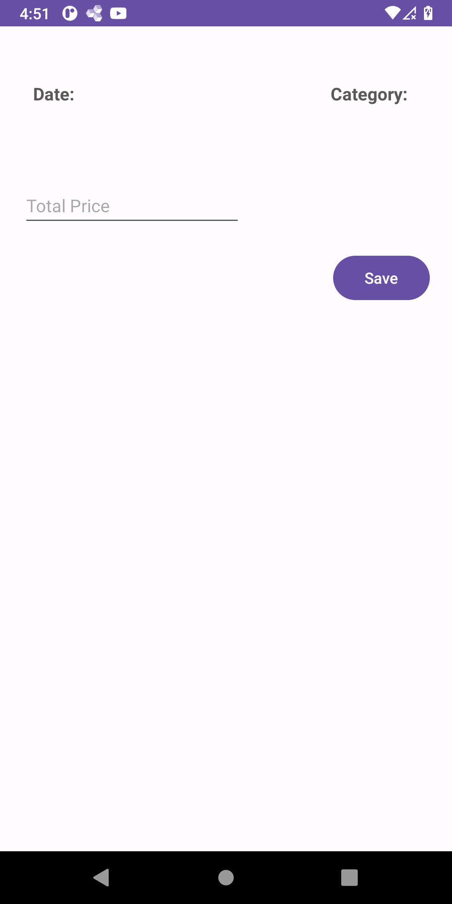

# Expense-History
Android project with RoomDB, WorkFlow Api, and Flow-Coroutine to add, edit, and filter expenses of the user.
The project has the functionality to back up and restore the database. 

# Technologies Used
<ul>
  <li>Navigation Component: To navigate between fragments</li>
  <li>Koin: For Dependency Injection</li>
  <li>Room DB: Library for CRUD operations </li>
  <li>Android Lifecycle: Performing threading operation with lifecycle awareness </li>
  <li>Kotlin Coroutines: Library for executing multi-thread operations </li>
  <li>Kotlin FLow </li>
  <li>GSON: Used for converting database table to GSON file </li>
  <li>WorkManger: Used for executing Backup - Restore operations</li>
</ul>  

# Database Structure
The database has 3 tables. Users, Categories, and Expenses.

Relation:
<ul>
  <li>Every category is connected to a user and can be a sub-category for another one</li>
  <li>Every Expense is connected to a category </li>
</ul>  

# Screenshots 
<h2>1. Expense List</h2> 

List All the expenses saved in DB and group them by the month

<h2>#2 Filter Expenses </h2>

<h3>#2.1 Filter by user & category </h3>

Filter by user and / or category 

<h3>#2.2 Filter by Date </h3>

You can also filter by selecting a date range

<h2>3. Add New Expense</h2> 

New expense page to add all the pieces of information required to the database

<h3>#3.1 Select Date </h3>

Add a date to the new transaction by selecting a day from the Date Picker Dialog 

<h3>#3.2 Select Category </h3>

Add a Category from the list of categories

<h3>#4. Edit Expense </h3>

<h2>5. Settings </h2> 

Settings page where you can modify the user and category table or backup and restore the database.

<h2>6. User Detail </h2> 

This page will list the user information. You can edit or delete the user. If there are any users related to it, they will be displayed in the Sub Users table

<h2>7. Category Detail </h2> 

This page will list the category information. You can edit or delete it. If there are any categories related to it, they will be displayed in the Sub Categories table

